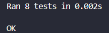

# 🦁 Ponderada do zoológico 🐘

## Classes adicionadas
1. "Zoologico"
2. "Recinto"
3. "Animal"

### 1. Zoologico
#### Métodos:
1. __criarRecinto()__: Criar recinto, sem a necessidade de definir o parâmetro "zoologico";
2. __receberVisitante()__: Receber visitantes.

__OBS:__
- Automaticamente, um zoológico recebe 1 visitante quando um animal do zoológico fica feliz (quando seu nível de felicidade atinge o valor 3).
- Automaticamente, um zoologico recebe 1 visitante quando um recinto é bem cuidado.

### 2. Recinto
#### Métodos:
1. __validarEspecie()__: Validar espécie;
2. __adicionarAnimal()__: Adicionar um ou vários animais;
3. __removerAnimal()__: Remover um ou vários animais;
4. __obterAnimais()__: Obter uma lista de animais no recinto;
5. __cuidarRecinto()__: Cuidar do recinto.

__OBS:__
- Antes de adicionar um animal, é feita uma validação para que apenas espécies do recinto possam entrar.
- Os métodos "removerAnimal" e "adicionarAnimal" aceita como argumento tanto um único animal ou uma lista de animais.

### 3. Animal
#### Métodos:
1. __alimentar()__: Alimentar um animal;
2. __aumentarNivelFelicidade()__: Aumentar 1 ponto do nível de felicidade de um animal.

__OBS:__
- Automaticamente, ao alimentar um animal, seu nível de felicidade aumenta 1 ponto.

## Passo a passo para: "Como testar?"
1. Vá para o diretório raíz do repositório;
2. No terminal, digite "cd src" para mudar o diretório.
3. No terminal, digite "python -m unittest testes.py".

__E pronto!__ 🥳

